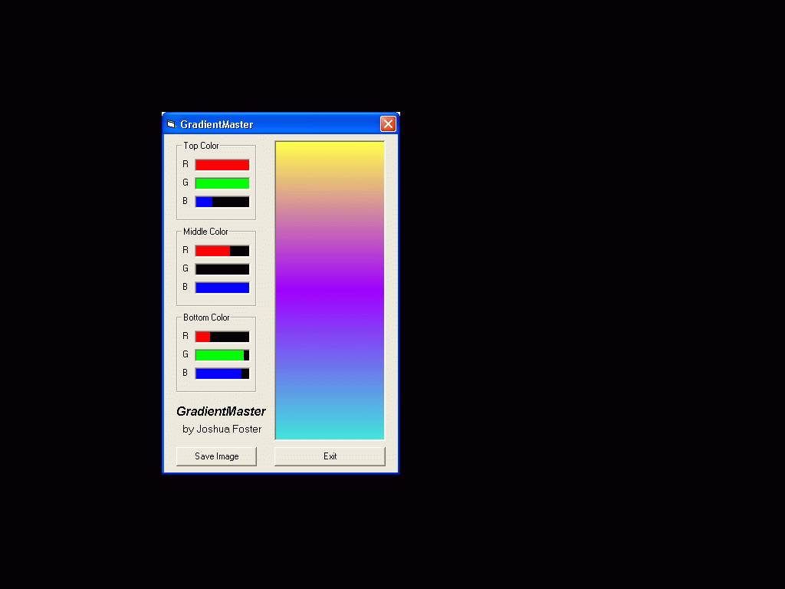



## Gradient2

### Description

Don't laugh -- it's only my second VB program ever! Creates three-level gradients. Uses a custom-made color control. The gradient has a vertical resolution of 500 so it will still look fine as a streched background.
 
### More Info
 
Drag the RGB sliders and the gradient will dynamically update.

             |
---                |---
**Submitted On**   |2002-04-13 14:35:30
**By**             |[josh2112](https://github.com/Planet-Source-Code/PSCIndex/blob/master/ByAuthor/josh2112.md)
**Level**          |Beginner
**User Rating**    |5.0 (10 globes from 2 users)
**Compatibility**  |VB 6\.0
**Category**       |[Graphics](https://github.com/Planet-Source-Code/PSCIndex/blob/master/ByCategory/graphics__1-46.md)
**World**          |[Visual Basic](https://github.com/Planet-Source-Code/PSCIndex/blob/master/ByWorld/visual-basic.md)
**Archive File**   |[Gradient2716734132002\.zip](https://github.com/Planet-Source-Code/josh2112-gradient2__1-33772/archive/master.zip)

